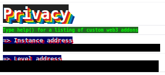
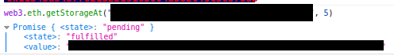
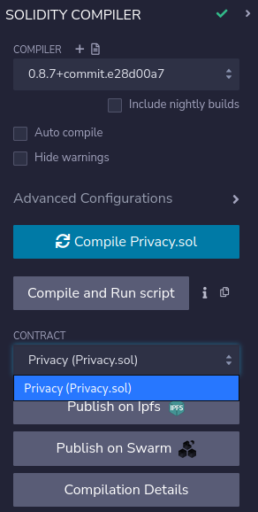
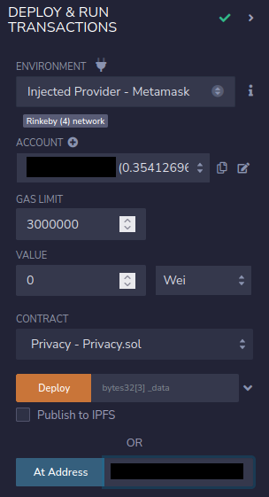
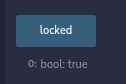
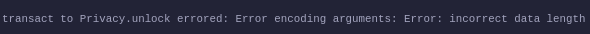
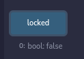

# 12: Privacy

The Ethernaut is a Web3/Solidity based wargame inspired by overthewire.org, played in the Ethereum Virtual Machine, in which each level is based on a smart contract that needs to be "hacked".

This is a sample walkthrough for the level called "Privacy".

## Setup

First off we need a wallet. Get the Metamask Wallet from https://metamask.io/ and choose whichever network works for you ( in my case i will be using Rinkeby's testnet).
Fund the wallet with Chainlink's faucet https://faucets.chain.link/rinkeby and then click on the button "Get new instance" to deploy the contract.

## Steps for completing the level
Click on F12 to get on Developer Tools. You will get something like this:

Copy the Privacy.sol contract found before "submit instance" and "get new instance" buttons.

Go on Remix: https://remix.ethereum.org/ and make these next changes in Privacy.sol.:
>- <value> 1. Pragma version from **0.6.0** to **0.8.0**
>- <value> 2. Change from **now** to **block.timestamp**

This level asks us find the bytes16 key of the contract. The function unlock() tells us that to complete this level we need the key to be assigned to the bytes16(data[2]) of our Privacy contract. Knowing that data is defined as a bytes32 private global variable it should mean that there are 2 types of bytes16 stored in it's slots. Private or not, we can still find the right data variable using Developer Tools with F12.

Use the web3.eth.getStorageAt function with your instance's address and also add **5** to check the data variable:

Compile the Privacy.sol contract:

 Until we use the bytes32 private data variable we found, let's interact with the already deployed contract by using instance's address showed on Developer Tools. Also, dont forget to add your wallet on Environment by selecting "Injected Provider - Metamask".

Check the locked variable:

Now that we have got the bytes32 data variable and know that one byte represents 2 digits, we could try the first 16 digits of our data and see if it does unlock our contract: 

It gives as an error because the length of the input is not bytes16, but it's bytes8.

Try the first 32 digits together with the "0x" at the beginning ("0x55fc9b7235039c6aeae8c38f3f738bdd") with the unlock() function and check your locked function:

Wow, congrats!! You have managed to unlock the Privacy level by using the so called **private** data, but also have completed this level.

Now finish the level by using the submit button at the bottom of the page.

Congrats! See you on to the next level.:wave: